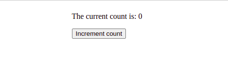
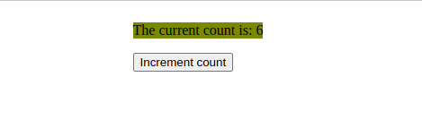
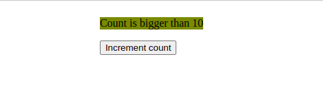
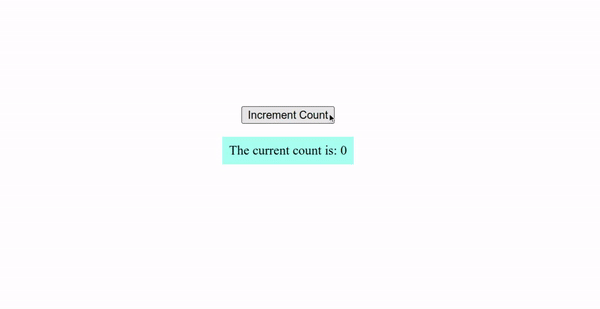

# Counter App

## Exercise Course-Module 3 - Single Page Application (SPA) - HTML/CSS/JavaScript/React.js

created at 12.02.23

By creating this app I practiced React.js state handling, components, passing props and conditional rendering.

When the button is clicked, it increments count, starts from zero and is handled using the `useState` hook. A component called [Text.js](src/components/Text.js) was imported into [App.js](src/App.js), contains only one `p` element and accept the prop: `count`. The `p` element has different styles and different text based on the value of the prop it is being passed oriented to the

#### Mockups:

1.  If the value of count is bigger than 5, it should have olive background color.

2.  If the value of count is smaller than 10, it renders the count. If count is bigger than 10, it renders the following sentence 'Count is bigger than 10'

#### My Version:

